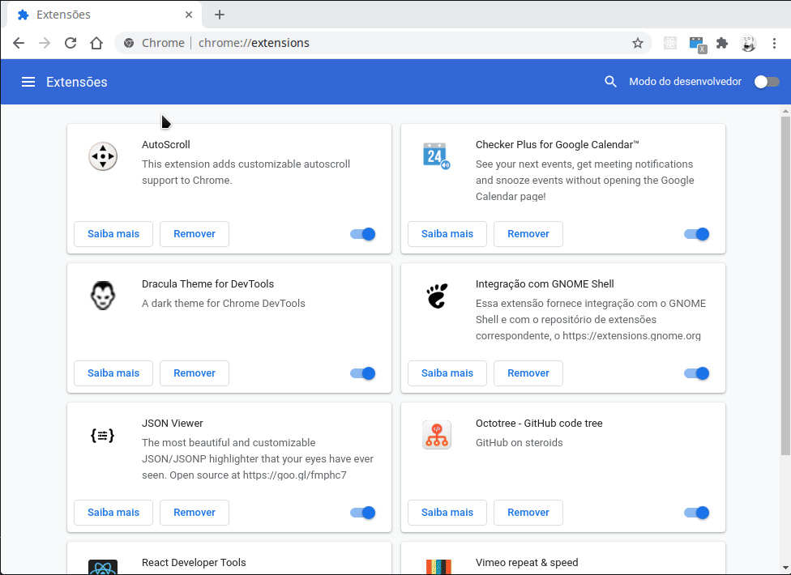

<h1>CPF Generator</h1>

Um plugin básico para geração de CPF

---

## Tutorial para instalação
* Acesse o endereço chrome://extensions no seu Chrome
* Habilite o ***'Modo do desenvolvedor'***
* Clique no botão ***'Carregar sem compactação'***
* Navegue até a pasta do projeto e clique no botão ***'Abrir'***
* Após carregado o plugin no Chrome, clique no botão de extensões no navegador e clique no botão ***'Fixar'*** ao lado da extensão para deixá-la fixa no navegador
* Clique no plugin Gerador de CPF para que o mesmo gere um CPF no formato válido
* Clique no botão ***'Copiar CPF'*** para copiar o CPF para a área de transferência

## Contribua com o projeto
Contribua com o projeto adicionando novas features ou fazendo correções!

## Licença
